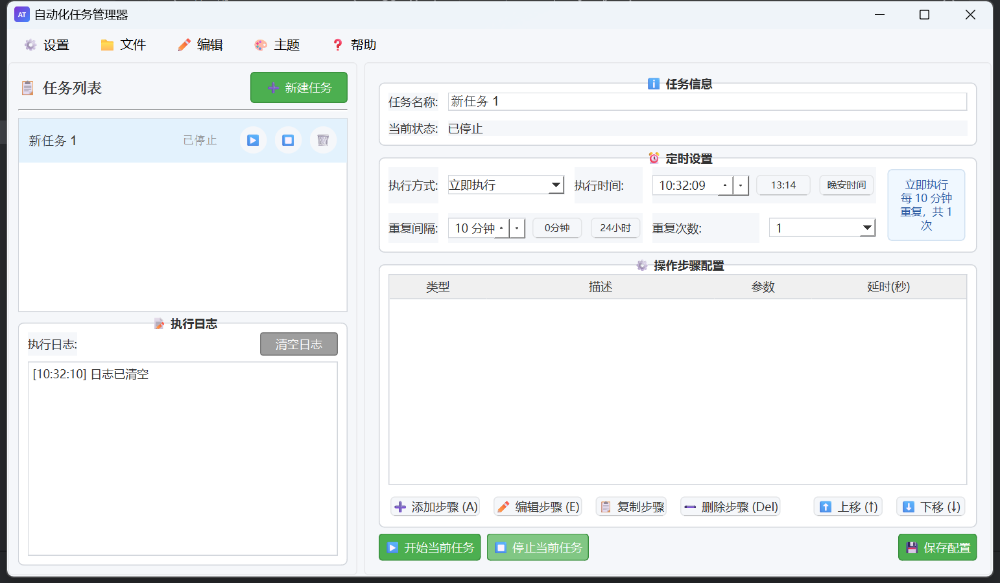

🎉 AutoTask-UI- ✨  
基于 PySide6 的零代码自动化桌面操作工具原型 🚀  
把每天都要重复的「固定步骤」抽象成可拖拽的「任务」🧩  
让 PyAutoGUI 在后台帮你精确复现 🎯，还能定时调度 ⏰，一键批量管理 📦！  
交流QQ群：1057721699（可直接下载软件包）

---

📑 目录  
1. 🌟 功能特性  
2. 🚀 快速开始  
3. 🖥 界面速览  
4. 🧪 任务配置示例  
5. 🛠 技术栈  
6. 🗺 路线图  
7. 🤝 贡献指南  
8. 📦 打包与部署  
9. 🧾 生成 requirements.txt  
10. ⚖️ 免责声明  
11. 📜 License  

---

## 1. 🌟 功能特性

| 特性 | Emoji | 说明 |
|---|---|---|
| 可视化任务编排 | 🖱️🎨 | 拖拽式步骤表格，支持「点击 / 双击 / 右键 / 滚轮 / 键盘输入 / 等待」等原子操作 |
| 多任务管理 | 📋🔁 | 新建 ➕、启动 ▶️、停止 ⏹️、重命名 ✏️、复制 📑、删除 🗑️ |
| 定时调度 | ⏰📅 | 单次 / 每日 / 循环间隔 三种策略 |
| 图片定位 | 🔍🖼️ | 基于 PyAutoGUI + OpenCV 模板匹配，无惧分辨率变化 |
| 热插拔配置文件 | 📁🔗 | JSON 格式，文件即任务，Git 友好 |

---

## 2. 🚀 快速开始

```bash
# 1️⃣ 克隆仓库
git clone https://github.com/junior6666/AutoTask-UI-.git 
cd AutoTask-UI-

# 2️⃣ 创建虚拟环境（可选）
conda create -n autotask-ui- python=3.9
conda activate autotask-ui-

# 3️⃣ 安装依赖
pip install -r requirements.txt
```

首次启动即可看到主界面，立即创建演示任务！🥳

---

## 3. 🖥 界面速览

- 左侧列表：右键解锁更多姿势 🖱️  
- 步骤表格：双击单元格编辑 ✏️，工具栏导入截图自动填路径 📸  
- 定时策略：启用后，可设置「每日 09:00」或「每 30 分钟」⏲️ 等等

---

## 4. 🧪 任务配置示例

| 步骤类型 | 参数示例 | 备注 |
|---|---|---|
| 🔘 点击 | `btn_ok.png` | 找到按钮并单击 |
| ⌨️ 输入 | `Hello, AutoTask!` | 在当前焦点处输入 |
| ⏱️ 等待 | `2.5` | 等待 2.5 秒 |
| 🖱️ 滚轮 | `-3` | 向下滚动 3 格 |

---

## 5. 🛠 技术栈

- GUI：🐍 PySide6  
- 自动化：🤖 PyAutoGUI + 🔍 OpenCV  
- 配置：📄 JSON / YAML (PyYAML)  
- 调度：⏲️ APScheduler（待集成）  
- 打包：📦 PyInstaller → 一键 `AutoTask.exe`

---

## 6. 🗺 路线图

- ✅ 基础任务编排
- 📊 运行日志 & 可视化报告  
- 🌐 Web 远程控制  (TODO)
- 🧩 插件市场 （TODO）

---

## 7. 🤝 贡献指南

1. Fork ➕ ⭐  
2. 新建分支 `feat/awesome-feature`  
3. 提交 PR 🚀  
4. 等待 Review & Merge 🎊

---

## 8. 📦 打包与部署

```bash
# 单文件 exe（无控制台）
pyinstaller -F -w -i icon.ico --add-data "img;img;" --name AutoTask main_plus.py

pyinstaller -F -w -i icon.ico --add-data "img;img" --name auto_Task2.0.2 main_plus.py
pyinstaller -F -w -i icon.ico --add-data "img;img" --name auto_Task2.0.3 main_plus.py
pyinstaller -F -w -i icon.ico --add-data "img;img" --name auto_Task2.0.4 main_plus.py
pyinstaller -F -w -i icon.ico --add-data "img;img" --name auto_Task2.0.5 main_plus.py
pyinstaller -F -w -i icon.ico --add-data "img;img" --name auto_Task2.0.6 main_plus.py
pyinstaller -F -w -i icon.ico --add-data "img;img" --name auto_Task2.0.7 main_plus.py
```

---

## 9. 🧾 生成 requirements.txt

开发完成后，请把**干净**的依赖导出，方便他人一键复现：

```bash
# 进入虚拟环境
conda activate autotask-ui-   # 或 venv 的 activate

# ① 快速导出（含所有子依赖）
pip freeze > requirements.txt

# ② 仅导出项目真实 import 的库（更干净）
pip install pipreqs
pipreqs ./ --encoding=utf-8 --force
```

> 若出现可编辑包（`@ file:///...`），请先 `pip uninstall -e .` 再执行。

---

## 10. ⚖️ 免责声明

1. **自动化风险**：本软件通过模拟鼠标/键盘操作实现自动化，若配置错误可能导致**误点击、数据丢失或系统设置变更**。使用前请在**非生产环境**充分测试。  
2. **图像识别局限**：模板匹配受分辨率/DPI/主题影响，**同一脚本在不同机器可能失效**，建议统一显示设置并预留容错重试。  
3. **定时任务**：调度功能依赖系统时钟与 APScheduler，**不保证极端场景下的准时性**，关键业务请配合专业调度平台。  
4. **合规性**：禁止用于**破坏软件协议、爬虫绕过、刷单、游戏外挂**等任何违法或侵犯第三方权益的场景；违者由使用者自行承担法律责任。  
5. **数据安全**：配置文件（`.json`/`.yml`）可能包含截图路径、账号等敏感信息，**勿直接上传至公开仓库**，建议加入 `.gitignore`。  
6. **开源授权**：本项目采用 MIT License，**无任何形式担保**，详见 [LICENSE](./LICENSE) 文件。

---

## 11. 📜 License  
MIT © 2024 AutoTask-UI Contributors 🧑‍💻👩‍💻

---

## 🐞 已知问题速查

| 错误 | 原因 | 解决 |
|---|---|---|
| `pyautogui.ImageNotFoundException` | PyAutoGUI ≥ 0.1.30 默认抛异常 | `pip install pyautogui==0.1.29` |
| 打包后图标/图片缺失 | 未正确添加 `--add-data` | 见第 8 节示例 |
| 索引卡死 | PyCharm 后台 3 processes | `File → Invalidate Caches → Restart` |
